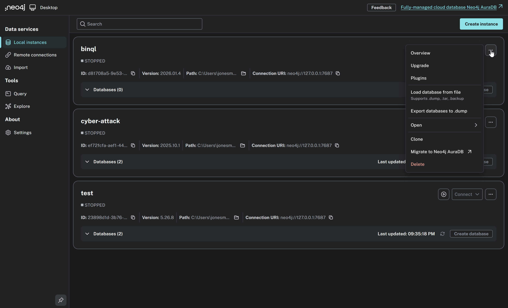

# 🔹 Lab 0.3 — Neo4j Desktop Setup (binql DB + APOC + GDS)

> 🔧 **This is a tool-running lab.** You will create a Neo4j Desktop database and install required plugins.
>
> ⚠️ **This lab requires executing steps in the Neo4j Desktop UI.**

---

## Overview

- **Goal:** Create a Neo4j Desktop database instance used in the workshop.
- **Inputs:** Neo4j Desktop installed.
- **Outputs:** A running `binql` database with APOC and Graph Data Science installed.

---

## 🎯 What You Need To Do

### Step 1: Download and Install Neo4j Desktop

1. Go to **<https://neo4j.com/download/>**
2. Download **"Neo4j for Desktop"** for your operating system
3. We recommend saving the download to a known location:
   - **Linux:** Download the `.AppImage` file to `/opt/` (e.g., `/opt/neo4j-desktop-2.1.1-x86_64.AppImage`). No installation needed — just make it executable and run it.
   - **Windows:** Download and run the `.exe` installer — it will install Neo4j Desktop like a standard application.
4. When prompted, create a free Neo4j account (or sign in if you already have one)

> ℹ️ Neo4j Desktop is free for local development use.
>
> ⚠️ **Version numbers may differ.** The versions shown in this lab (e.g., `2.1.1` for Neo4j Desktop, `2026.01.3` for the database) were current at the time of writing. When you download, you may see newer versions — that's fine. Use whatever version is offered.

### Step 2: Start Neo4j Desktop

#### Linux/macOS

```bash
/opt/neo4j-desktop-2.1.1-x86_64.AppImage &
```

> ℹ️ Your file name will include the version you downloaded (e.g., `neo4j-desktop-2.2.0-x86_64.AppImage`). Adjust the command accordingly.

#### Windows (PowerShell)

Launch **Neo4j Desktop** from the Start Menu or desktop shortcut.

### Step 3: Create the `binql` database instance

If this is your first time setting up the database:

1. Click **Create Instance** (or **New**)
2. Configure the instance:
   - Name: `binql`
   - Neo4j Version: `2026.01.3`
   - Password: `12345678`
3. Click **Create**
4. The database should start automatically after creation

### Step 4: Install APOC and GDS plugins

1. Select your `binql` database instance
2. Click the **⋯** (three-dot menu) button on the right side of the `binql` instance to open the instance options, then select **Plugins**



3. Find **APOC** and click **Install**
4. Find **Graph Data Science (GDS)** and click **Install**
5. Restart the database when prompted
6. After restart, verify the status is **Running**

> Note: APOC and GDS are required for the labs.
>
> ℹ️ **If the database is stopped after installing plugins**, you may need to manually start it. Click the **Start** button on the `binql` instance to start it.
>
> 

### Step 5: Validate connectivity from the command line

With your virtual environment activated, run the BinQL database check from the project root:

#### Linux/macOS

```bash
source venv/bin/activate
python -m lab_common.binql.binql_ul --check-db
```

#### Windows (PowerShell)

```powershell
.\venv\Scripts\Activate.ps1
python -m lab_common.binql.binql_ul --check-db
```

You should see:

```
✓ Neo4j liveness check passed (connectivity + credentials OK)
```

> ⚠️ **After starting the database, it may take a few minutes before the liveness check passes.** If you just clicked Start, you may initially see:
> ```
> ERROR - neo4j.pool - Unable to retrieve routing information
> ERROR - __main__ - ✗ Neo4j liveness check failed: Unable to retrieve routing information
> ```
> This is normal — wait 30–60 seconds and try again. The database needs time to fully initialize.

> This confirms that the Python environment can reach Neo4j with the configured credentials.

---

## ✅ Success Criteria

You’re done when:
- [ ] Neo4j Desktop is running
- [ ] The `binql` database instance is **Running**
- [ ] APOC is installed
- [ ] GDS is installed
- [ ] `python -m lab_common.binql.binql_ul --check-db` passes

---

## Summary

Neo4j is ready for the workshop. Proceed to Lab 1.

