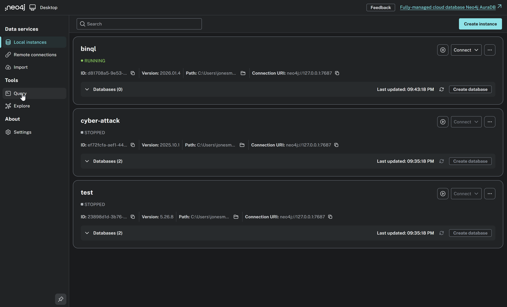
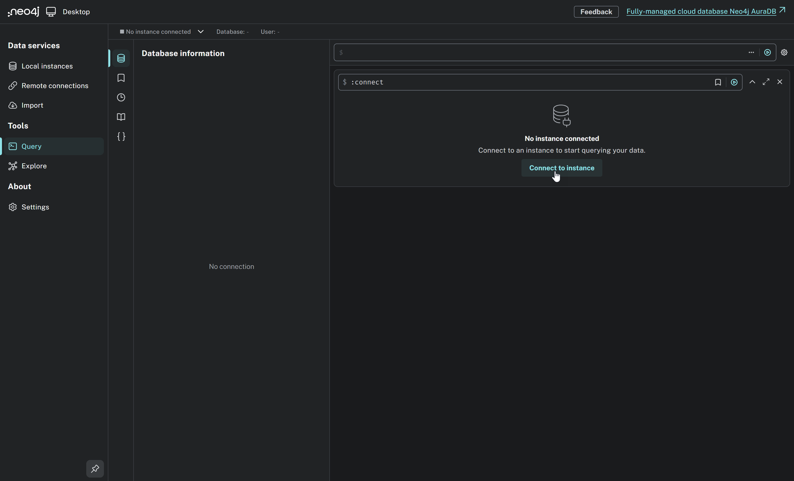
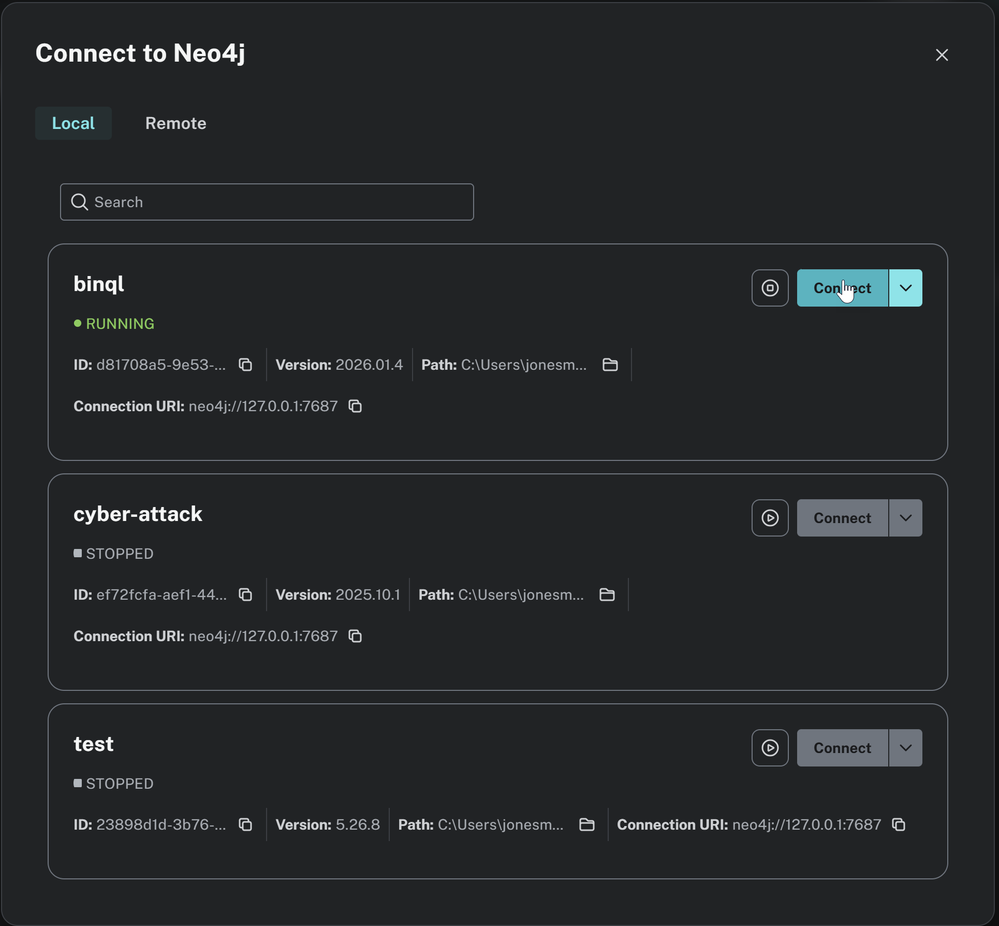
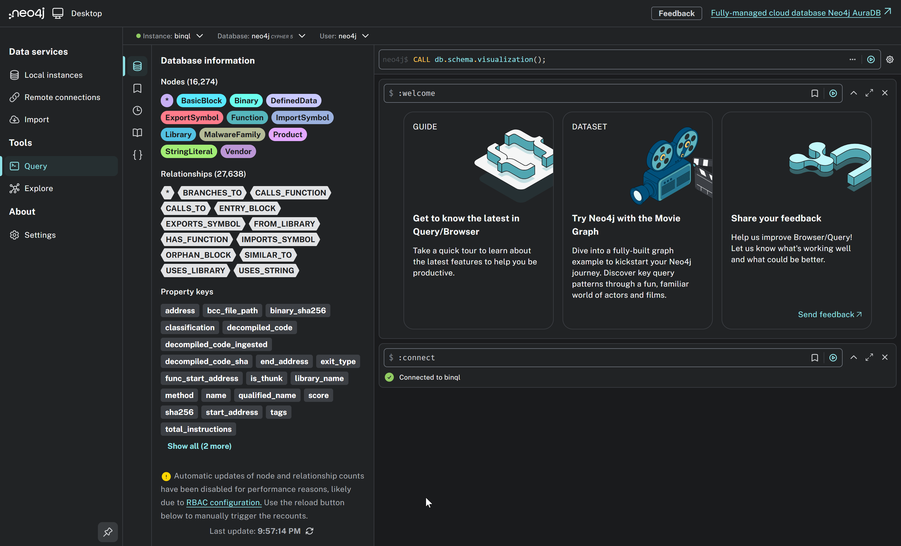
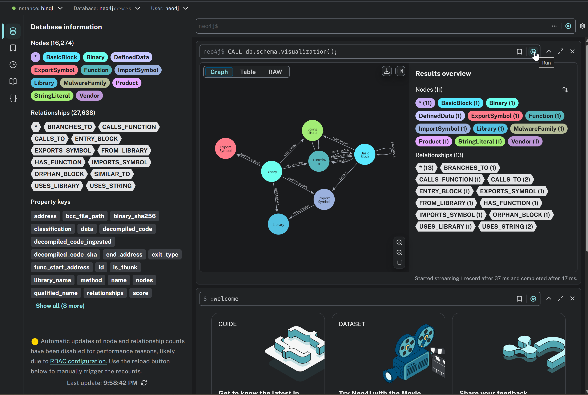

# 🔹 Lab 1.1 — Ingest BCC files and explore the graph in Neo4j Browser

> 📖 **This is a reading/exploration lab.** You will run ingestion commands and explore the graph visually, but you do not need to write any code.

> ⚠️ **This lab requires executing commands and queries.** You must run CLI commands and Neo4j Browser queries.

This lab covers the full ingestion workflow — from a single BCC file to a labeled corpus — and gives you hands-on
experience exploring the resulting graph in Neo4j Desktop Browser.

---

## Overview

- **Goal:** Ingest BCC files into Neo4j, attach metadata, and explore the graph visually.
- **Inputs:** BCC files in `dataset/lab1/`, Neo4j connection settings (loaded from config by default).
- **Outputs:** A populated Neo4j graph with 6 binaries, ready for querying in later labs.

> ℹ️ **Note:** This lab uses **benign binaries only**. The schema supports metadata nodes like `MalwareFamily`, but the lab dataset contains only benign samples to avoid endpoint-protection false positives on corporate machines.

---

## 🎯 What You Need To Do

> ℹ️ **Prerequisite:** Complete the **Lab 1 Setup** (see Lab 1.0 overview) before starting this lab. The database should be reset and connectivity verified.

### Step 1: Ingest a single BCC file

#### Linux/macOS

```bash
source venv/bin/activate
python -m lab_common.binql.binql_ul \
  --bcc dataset/lab1/bison_arm_9409117ee68a2d75643bb0e0a15c71ab52d4e90f_9409117ee68a2d75643bb0e0a15c71ab52d4e90fa066e419b1715e029bcdc3dd.bcc
```

#### Windows (PowerShell)

```powershell
.\venv\Scripts\Activate.ps1
python -m lab_common.binql.binql_ul `
  --bcc dataset\lab1\bison_arm_9409117ee68a2d75643bb0e0a15c71ab52d4e90f_9409117ee68a2d75643bb0e0a15c71ab52d4e90fa066e419b1715e029bcdc3dd.bcc
```

> ⏳ **Note:** Ingestion can take 1–2 minutes depending on your CPU. This is normal — the tool is parsing the BCC file and creating all graph nodes and relationships in Neo4j.

### Step 2: Verify ingestion

#### Linux/macOS

```bash
source venv/bin/activate
python -m lab_common.binql.binql_ul --list-binaries
```

#### Windows (PowerShell)

```powershell
.\venv\Scripts\Activate.ps1
python -m lab_common.binql.binql_ul --list-binaries
```

You should see the `bison_arm` binary listed with its SHA256 and function count.

### Step 3: Explore the graph in Neo4j Browser

To open the query editor, click **Query** in the left sidebar under **Tools** in Neo4j Desktop (make sure your `binql` instance is running):



If you see **"No instance connected"**, click the **Connect to instance** button to connect to your running `binql` database:



In the **Connect to Neo4j** dialog, find the **binql** instance (it should show **RUNNING**) and click the **Connect** button next to it:



Once connected, this opens the Neo4j Browser query editor where you can run Cypher queries against your database. You can copy and paste Cypher queries into the query bar at the top and click the **▶ Play** button (to the right of the query bar) to run them.

#### Visualize the schema/ontology

Start by pasting this query into the query bar:

```cypher
CALL db.schema.visualization();
```



Click the **▶ Play** button to run it. You'll see the **ontology** of the graph — a visual map of all node types (`Binary`, `Function`, `BasicBlock`, `StringLiteral`, etc.) and the relationships between them:



#### Run more queries

Now try these additional queries to explore the ingested data:

**List constraints:**

```cypher
SHOW CONSTRAINTS;
```

_Tip:_ Constraints are what make ingestion predictable and idempotent (e.g., a `Binary` is uniquely identified by its `sha256`).

**Binary overview:**

```cypher
MATCH (b:Binary)
WHERE b.name CONTAINS 'bison'
RETURN b.name, b.sha256, b.classification;
```

**Count functions:**

```cypher
MATCH (b:Binary)-[:HAS_FUNCTION]->(f:Function)
WHERE b.name CONTAINS 'bison'
RETURN count(f) AS function_count;
```

**List imports:**

```cypher
MATCH (b:Binary)-[:IMPORTS_SYMBOL]->(i:ImportSymbol)
WHERE b.name CONTAINS 'bison'
RETURN i.name AS import_name
ORDER BY import_name;
```

**List string literals (sample):**

```cypher
MATCH (b:Binary)-[:HAS_FUNCTION]->(f:Function)-[:ENTRY_BLOCK|ORPHAN_BLOCK]->(bb:BasicBlock)-[:USES_STRING]->(s:StringLiteral)
WHERE b.name CONTAINS 'bison'
RETURN DISTINCT s.value AS string_value
LIMIT 20;
```

### Step 4: Verify idempotency

Re-ingest the same BCC file to confirm that ingestion is idempotent:

#### Linux/macOS

```bash
source venv/bin/activate
python -m lab_common.binql.binql_ul \
  --bcc dataset/lab1/bison_arm_9409117ee68a2d75643bb0e0a15c71ab52d4e90f_9409117ee68a2d75643bb0e0a15c71ab52d4e90fa066e419b1715e029bcdc3dd.bcc
```

#### Windows (PowerShell)

```powershell
.\venv\Scripts\Activate.ps1
python -m lab_common.binql.binql_ul `
  --bcc dataset\lab1\bison_arm_9409117ee68a2d75643bb0e0a15c71ab52d4e90f_9409117ee68a2d75643bb0e0a15c71ab52d4e90fa066e419b1715e029bcdc3dd.bcc
```

Then verify the binary count has not changed:

```cypher
MATCH (b:Binary) RETURN count(b) AS binary_count;
```

The count should still be 1 — ingestion is **idempotent** (re-ingesting the same BCC updates rather than duplicates).

### Step 5: Ingest the benign corpus directory

Examine the dataset first:

#### Linux/macOS

```bash
ls -la dataset/lab1/benign_corpus/
cat dataset/lab1/benign_corpus/metadata.json
```

#### Windows (PowerShell)

```powershell
Get-ChildItem dataset\lab1\benign_corpus\
Get-Content dataset\lab1\benign_corpus\metadata.json
```

You should see 5 `.bcc` files and a `metadata.json` file. The metadata provides directory-level defaults:

```json
{
  "classification": "benign",
  "tags": ["lab1", "benign-corpus"]
}
```

Now ingest the directory:

#### Linux/macOS

```bash
source venv/bin/activate
python -m lab_common.binql.binql_ul --bcc_dir dataset/lab1/benign_corpus/
```

#### Windows (PowerShell)

```powershell
.\venv\Scripts\Activate.ps1
python -m lab_common.binql.binql_ul --bcc_dir dataset\lab1\benign_corpus\
```

### Step 6: Verify the full corpus

#### Linux/macOS

```bash
source venv/bin/activate
python -m lab_common.binql.binql_ul --list-binaries
```

#### Windows (PowerShell)

```powershell
.\venv\Scripts\Activate.ps1
python -m lab_common.binql.binql_ul --list-binaries
```

You should see 6 binaries total (1 bison_arm + 5 benign corpus samples).

---

## ✅ Success Criteria

You have completed this lab when:
- [ ] `bison_arm` binary is ingested and visible in `--list-binaries`
- [ ] You can visualize the schema with `CALL db.schema.visualization()` in Neo4j Browser
- [ ] You can query functions, imports, and strings for the binary in Neo4j Browser
- [ ] Re-ingesting the same BCC does not create duplicates
- [ ] All 5 benign corpus BCCs are ingested (6 binaries total)
- [ ] `--list-binaries` shows 6 binaries

---

## Summary

- You ingested a single BCC file using `--bcc` and a directory using `--bcc_dir`.
- You explored the graph schema and queried nodes/relationships in Neo4j Browser.
- You confirmed that ingestion is idempotent.
- You used `metadata.json` to attach classification and tags to binaries.

---

## 📚 Additional Reading

### What is a BCC file?

A **Binary Context Container (BCC)** is a serialized file produced by Blackfyre that captures the lifted program context of a binary:
functions, basic blocks, control flow edges, call edges, imports, exports, strings, and defined data. It is architecture-independent
and can be generated from ELF, PE, Mach-O, and other formats.

The BCC decouples **binary lifting** (done once, possibly on a different machine with the disassembler) from **graph ingestion**
(done here, into Neo4j). This separation means:

- You don't need the original binary or disassembler on the machine running `binql-ul`.
- BCCs can be shared, versioned, and archived independently.
- Ingestion is fast because the heavy lifting (disassembly) is already done.

### Ingestion pipeline (single BCC)

When you run `--bcc <path>`, `binql-ul` performs these steps:

1. **Load** the BCC file (deserialize the Blackfyre `BinaryContext`).
2. **Create/update** the `Binary` node (keyed by SHA256).
3. **Create** `Function` nodes with composite keys `(binary_sha256, start_address)`.
4. **Create** `BasicBlock` nodes with composite keys `(binary_sha256, start_address)`.
5. **Create** edges: `HAS_FUNCTION`, `ENTRY_BLOCK`, `ORPHAN_BLOCK`, `BRANCHES_TO`, `CALLS_TO`, `CALLS_FUNCTION`.
6. **Create** `StringLiteral`, `ImportSymbol`, `ExportSymbol`, `Library`, `DefinedData` nodes and their edges.
7. **Apply** metadata from `metadata.json` if present in the BCC file's directory.

All operations use `MERGE` (not `CREATE`), which is why re-ingestion is idempotent.

### The `metadata.json` format

The `metadata.json` file provides **directory-level defaults** that apply to every BCC in the directory, with optional per-file overrides:

```json
{
  "classification": "benign",
  "tags": ["lab1", "benign-corpus"],
  "overrides": {
    "specific_file.bcc": {
      "classification": "suspicious",
      "tags": ["needs-review"]
    }
  }
}
```

Supported metadata fields (at root level or inside `overrides`):

| Field | Type | Description |
|-------|------|-------------|
| `classification` | STRING | One of: `"benign"`, `"malicious"`, `"suspicious"`, `"unknown"` |
| `tags` | LIST | Array of string tags for categorization |
| `vendor` | STRING | Firmware/software vendor name (creates `Vendor` node) |
| `product` | STRING | Product name (creates `Product` node, requires `vendor`) |
| `firmware_version` | STRING | Firmware version string |

### How `--bcc_dir` works

When you run `--bcc_dir <path>`, `binql-ul`:

1. **Scans** the directory for `*.bcc` files.
2. **Loads** `metadata.json` from the directory (if present).
3. **Ingests** each BCC file, applying matching metadata.
4. **Respects** `--max_files` to limit batch size (default: 20, 0 = no limit).

### Graph Entity Reference

The program graph consists of **11 node types** (entities) and **14 relationship types**. Here is a summary of the core entities:

| Entity | Unique Key | Description |
|--------|-----------|-------------|
| `Binary` | `sha256` | Root entity representing an analyzed executable |
| `Function` | `(binary_sha256, start_address)` | A function within a binary |
| `BasicBlock` | `(binary_sha256, start_address)` | A basic block within a function |
| `StringLiteral` | `sha256` | A string constant (shared across binaries) |
| `ImportSymbol` | `qualified_name` | An imported function (e.g., `libc.so.6!printf`) |
| `ExportSymbol` | `(binary_sha256, address, name)` | An exported symbol |
| `Library` | `name` | An external library |
| `MalwareFamily` | `name` | Family classification (used in production workflows) |
| `Vendor` | `name` | Firmware/software vendor |
| `Product` | `(vendor_name, name)` | Product line from a vendor |
| `DefinedData` | `(binary_sha256, address)` | Global variables and constants |

Key relationship types: `HAS_FUNCTION`, `ENTRY_BLOCK`, `ORPHAN_BLOCK`, `BRANCHES_TO`, `CALLS_TO`, `CALLS_FUNCTION`, `USES_STRING`, `IMPORTS_SYMBOL`, `EXPORTS_SYMBOL`, `FROM_LIBRARY`, `USES_LIBRARY`, `BELONGS_TO_FAMILY`, `IMPLEMENTS_PRODUCT`, `FROM_VENDOR`.

For the full property tables and constraint DDL, see `lab_common/binql/binql_ul.py`.

---
